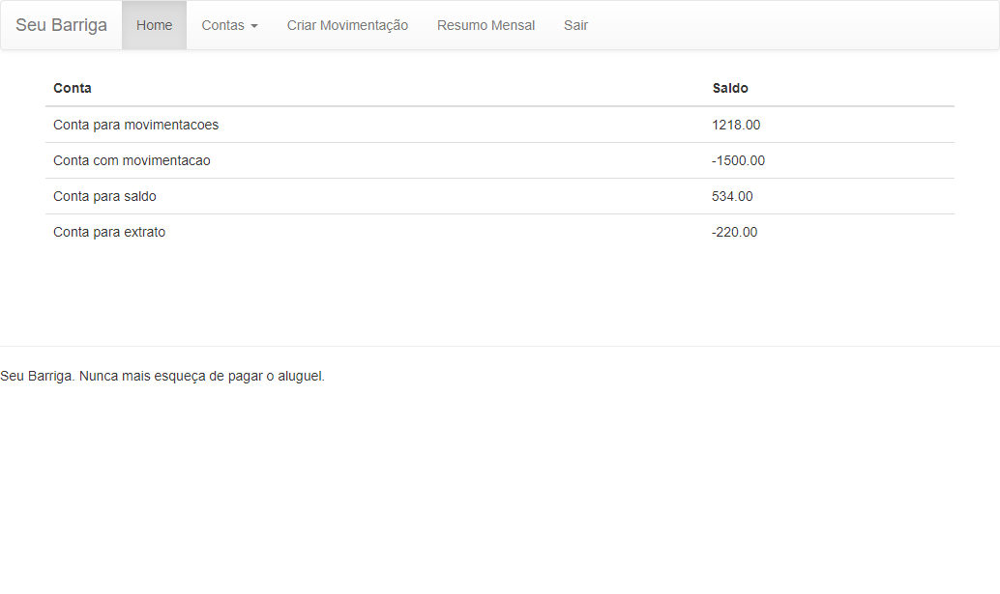
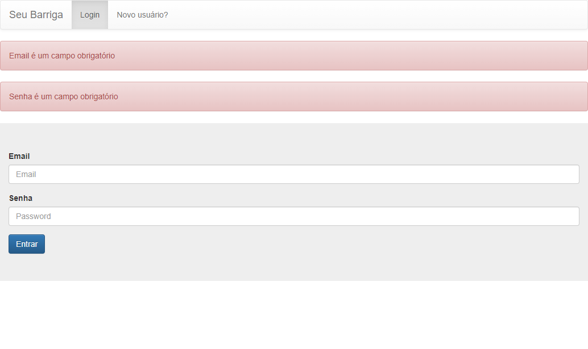

<h1 align="center">
  <a href="https://github.com/JanioAbrantes/demoday-project">
    <!-- Please provide path to your logo here -->
    
  </a>
</h1>

  Demoday Project
   
  <a href="#about"><strong>Explore the screenshots »</strong></a>
   
  

 

Table of Contents

- [About](#about)
  - [Built With](#built-with)
- [Getting Started](#getting-started)
  - [Prerequisites](#prerequisites)
- [Usage](#usage)
- [Authors](#authors)
- [License](#license)

---

## About

> **This is the final project of the Instituto Atlântico Bootcamp QA.
> This project consists in create 10 automation scripts, using the Robot Framework, to do some tests using the 
> Sr. Barriga website (https://seubarriga.wcaquino.me/login)**

Screenshots

|                                     Home Page                                      |                               Login Page                               |
|:----------------------------------------------------------------------------------:| :--------------------------------------------------------------------: |
|  |  |

### Built With

> **Robot Framework, VS Code, Python and SeleniumLibrary**

## Getting Started

### Prerequisites

> python==3.10.8  
> robotframework==5.0.1  
> robotframework-faker==5.0.0  
> robotframework-pythonlibcore==3.0.0  
> robotframework-selenium2library==3.0.0  
> robotframework-seleniumlibrary==6.0.0  
> selenium==4.5.0

## Usage

> **There are some commands you can run to execute all or some tests.  
> Run all tests: python -m robot.run Tests (This is the folder name that contains our tests)  
> Run a single suit: python -m robot.run Tests/Accounts/accounts_tests.robot (This is the file name that contains the tests)  
> Run a single test: python -m robot.run -t "Create new account" Tests/Accounts/accounts_tests.robot (Use the test name inside the " " and then the path location of the test**

## Authors

The original setup of this repository is by [Janio Abrantes](https://github.com/JanioAbrantes),
[Katarina Mariano](https://github.com/KatarinaMariano-QA),
[Laise Lopes](https://github.com/laise12) and 
[Victor Cavalcante]().

## License

This project is licensed under the **GNU General Public License v3**.

See [LICENSE](LICENSE) for more information.